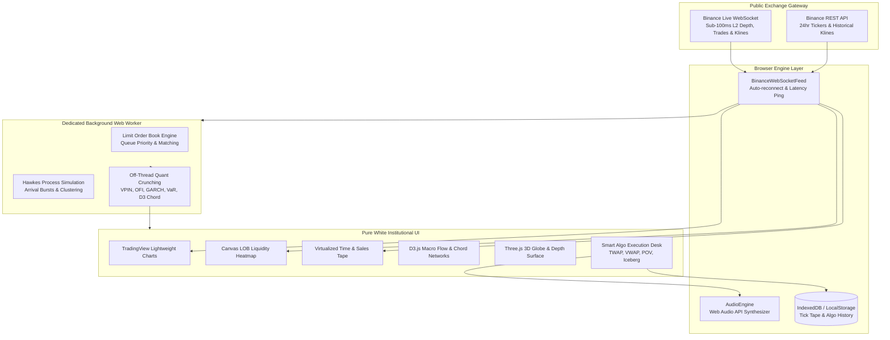

<div align="center">

# ⚡ Hermex
### Institutional HFT & Statistical Market Analytics Terminal

[](https://react.dev/)
[](https://www.typescriptlang.org/)
[](https://tailwindcss.com/)
[](https://vitejs.dev/)
[](LICENSE)

**Hermex** is an institutional-grade, zero-backend market analytics and high-frequency trading terminal. It delivers sub-100ms real-time market microstructure analysis, mathematical risk models, and interactive visualizations — running **100% client-side** in your web browser.

[Live Demo](https://hermex-terminal.netlify.app) • [Why Hermex?](#-why-hermex) • [Architecture](#-architecture) • [Features](#-core-capabilities) • [Workspaces](#-workspaces) • [Quick Start](#-quick-start)

</div>

---

## 🏛 Why "Hermex"?

> *"Named after **Hermes** — the swift Greek god of commerce, boundaries, and trade, known for his winged sandals that permitted instantaneous transit between realms."*

In high-frequency trading and algorithmic execution, **speed, timing, and frictionless exchange** dictate the boundary between alpha and slippage. 

**Hermex** combines:
- **Hermes (Ἑρμῆς)**: The patron divinity of merchants, trade flow, and swift cross-venue transit.
- **Ex (Exchange & Execution)**: Sub-100ms L2 limit order book matching, Kyle's Lambda slippage modeling, and decentralized public WebSocket streaming.

---

## 🌟 What Makes Hermex Different?

Modern institutional trading terminals (like Bloomberg Terminal or TradingView Pro) typically require massive backend infrastructures, expensive subscription APIs, and server-side computations.

**Hermex reinvents this approach:**
- **Zero Backend Required**: Directly streams live exchange WebSockets from public Binance endpoints (`depth20@100ms`, `aggTrade`, `kline_1m`) with zero proxy servers or API paywalls.
- **Ultra-Low Latency (15–40ms)**: Offloads heavy quantitative mathematics (Monte Carlo simulations, GARCH volatility, Hawkes processes) to a dedicated multithreaded **Web Worker**.
- **Pure Minimalist Design**: Institutional white canvas (`#ffffff` / `#f8fafc`) crafted with crisp typography, mathematical clarity, and responsive mobile-first views.
- **Zero External Assets**: Custom procedural Web Audio synthesis for sound effects and native SVG/Canvas/WebGL visualizers without external audio or icon files.

---

## 🏗 Architecture

Hermex follows a decoupled, reactive event-driven architecture designed for zero UI stuttering and rock-solid 60–120 FPS performance:



### Architectural Highlights
1. **Multithreaded Processing (`HftWorkerClient` & `hft-worker.ts`)**:
   - Isolates CPU-intensive calculations (10,000 Monte Carlo runs, Pearson correlation matrices, and VPIN toxicity) from the UI thread.
2. **Modular Utility Architecture (`src/utils/`)**:
   - Cleanly separates UI rendering from business logic (`quant-helpers`, `chart-helpers`, `order-helpers`, `command-helpers`, `formatters`).
3. **Encapsulated Class Design**:
   - Strict TypeScript access protectors (`private`, `readonly`, `public`, `static`) ensure predictable state mutation across services.

---

## ⚡ Core Capabilities

| Feature | Description |
|---|---|
| **📊 VPIN Toxicity (Volume-Synchronized Probability of Toxicity)** | Quantifies adverse selection risk and detects informed trader order flow imbalances across volume buckets. |
| **🌊 Order Flow Imbalance (OFI)** | Real-time calculation of liquidity deltas at the Best Bid & Offer (BBO) with directional pressure indicators. |
| **📈 GARCH(1,1) Volatility Forecasting** | Rolling conditional volatility forecasting with statistical regime classifications (*Normal, Elevated, Extreme*). |
| **🎲 Monte Carlo Value-at-Risk (VaR)** | 10,000 off-thread simulated portfolio trajectories calculating 1-day 95%/99% VaR and Expected Shortfall (CVaR). |
| **🔥 Dynamic Liquidity Heatmap (Bookmap Style)** | High-resolution HTML5 Canvas rendering of historical depth density, bid/ask depth walls, and whale liquidity clusters. |
| **⚡ Sub-100ms L2 Depth Ladder** | Millisecond-accurate order book ladder showing micro-price weighted spread, depth ratio, and cumulative order volume. |
| **🤖 Smart Algo Order Router** | Live simulation of institutional execution algorithms including **TWAP**, **VWAP**, **POV (15%)**, and **Iceberg** orders with Kyle's Lambda slippage estimation. |
| **🔊 Native Web Audio Synthesizer** | Harmonic sine/sawtooth audio triggers for whale orders (>$100k), algo order fills, and toxicity alerts without external audio files. |

---

## 🖥 Workspaces

Navigate effortlessly via keyboard shortcuts or the **Spotlight Command Palette (`Cmd + K`)**:

- **⚡ Overview Workspace (`⌥ + 1`)**:
  Executive cockpit displaying the TradingView chart, L2 depth ladder, liquidity heatmap, active tape, and quant KPIs in a single responsive view.
- **🔬 Microstructure & LOB (`⌥ + 2`)**:
  Deep-dive into high-frequency limit order books, bid/ask queues, and order book imbalance metrics.
- **📊 Quant & Statistical Trends (`⌥ + 3`)**:
  D3.js interactive correlation chord networks, Pearson correlation heatmaps, Hurst exponents, and Sharpe/Sortino performance ratios.
- **🤖 Smart Algo Lab (`⌥ + 4`)**:
  Interactive execution console with customizable slice durations, market impact models, and live simulated fills.
- **🛡 Portfolio & Risk (`⌥ + 5`)**:
  Multi-asset position tracker, P&L attribution, drawdown analysis, and Monte Carlo confidence intervals.

---

## 🚀 Quick Start

### Prerequisites
- [Node.js](https://nodejs.org/) (version 18.x or higher recommended)
- `npm` or `pnpm` / `yarn`

### Installation & Run

```bash
# 1. Clone repository
git clone https://github.com/novartus/Hermex.git
cd Hermex

# 2. Install dependencies
npm install

# 3. Start high-speed local dev server
npm run dev
```

Visit `http://localhost:3000` in your browser. The terminal will immediately connect to public WebSocket feeds and begin streaming live market data.

### Production Build & Preview

```bash
# Type-check and build optimized bundle
npm run build

# Preview production build locally
npm run preview
```

---

## 🛠 Tech Stack

- **Framework**: [React 19](https://react.dev/) + [TypeScript 5.8](https://www.typescriptlang.org/)
- **Build Tool**: [Vite 8](https://vitejs.dev/) with Rollup/Rolldown chunking
- **Styling**: [Tailwind CSS v4](https://tailwindcss.com/) with `@tailwindcss/vite`
- **Charts & 3D**:
  - [TradingView Lightweight Charts (v4.2)](https://tradingview.github.io/lightweight-charts/)
  - [D3.js (v7)](https://d3js.org/) (Chord networks & flow diagrams)
  - [Three.js](https://threejs.org/) (3D liquidity surfaces & globe visualizer)
- **Icons**: [Lucide React](https://lucide.dev/)
- **Persistence**: IndexedDB + LocalStorage

---

## 📄 License & Credits

Distributed under the **MIT License**. See [`LICENSE`](LICENSE) for more information.

Crafted with care by **[Novartus](https://novartus.github.io/)**.
